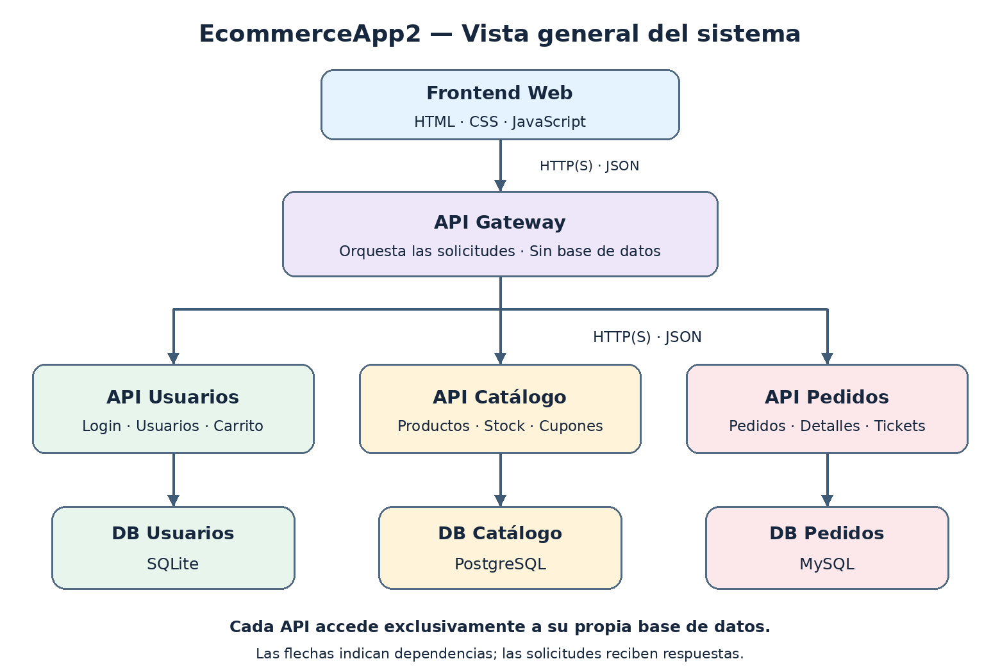
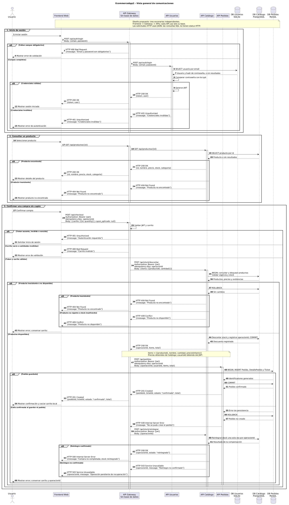
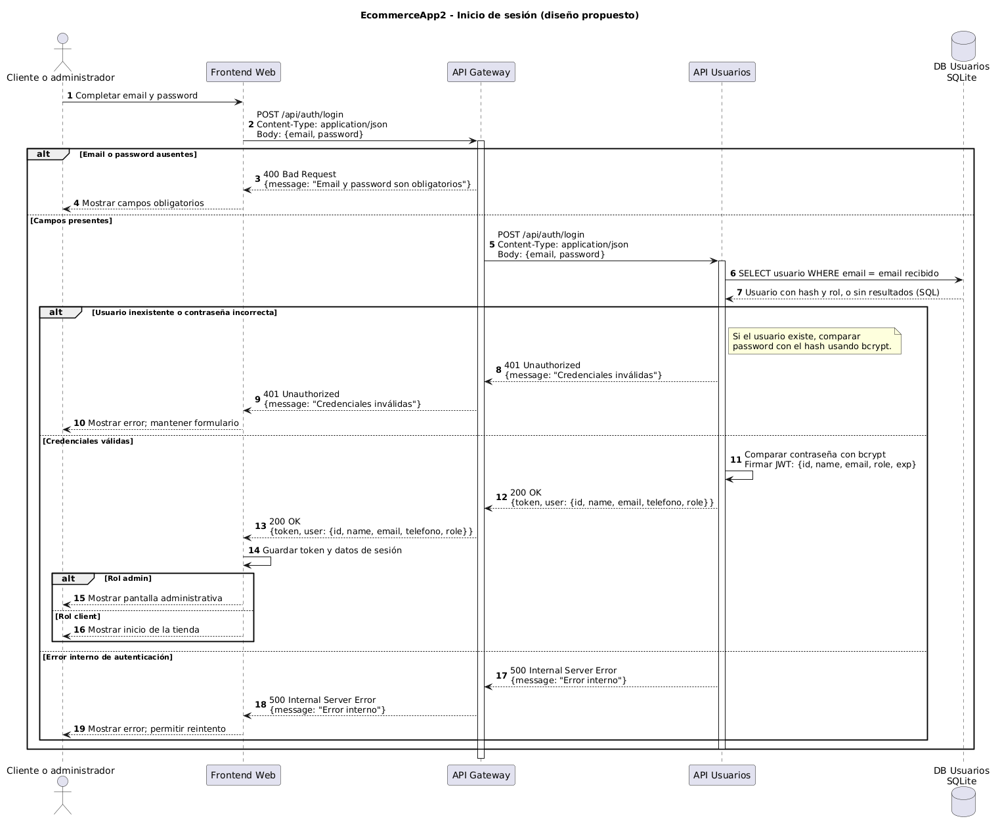
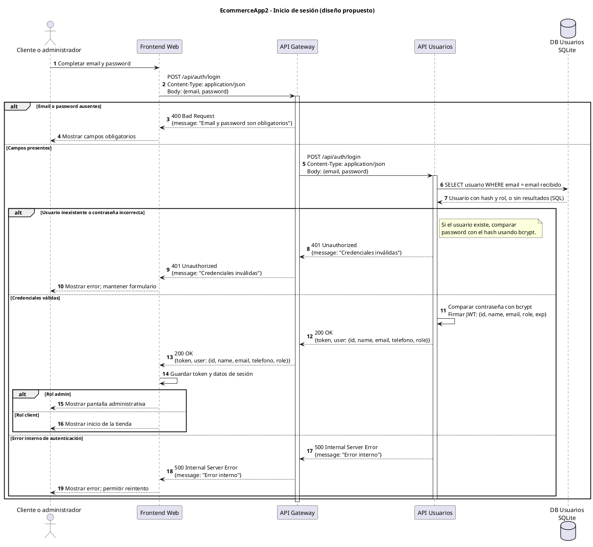
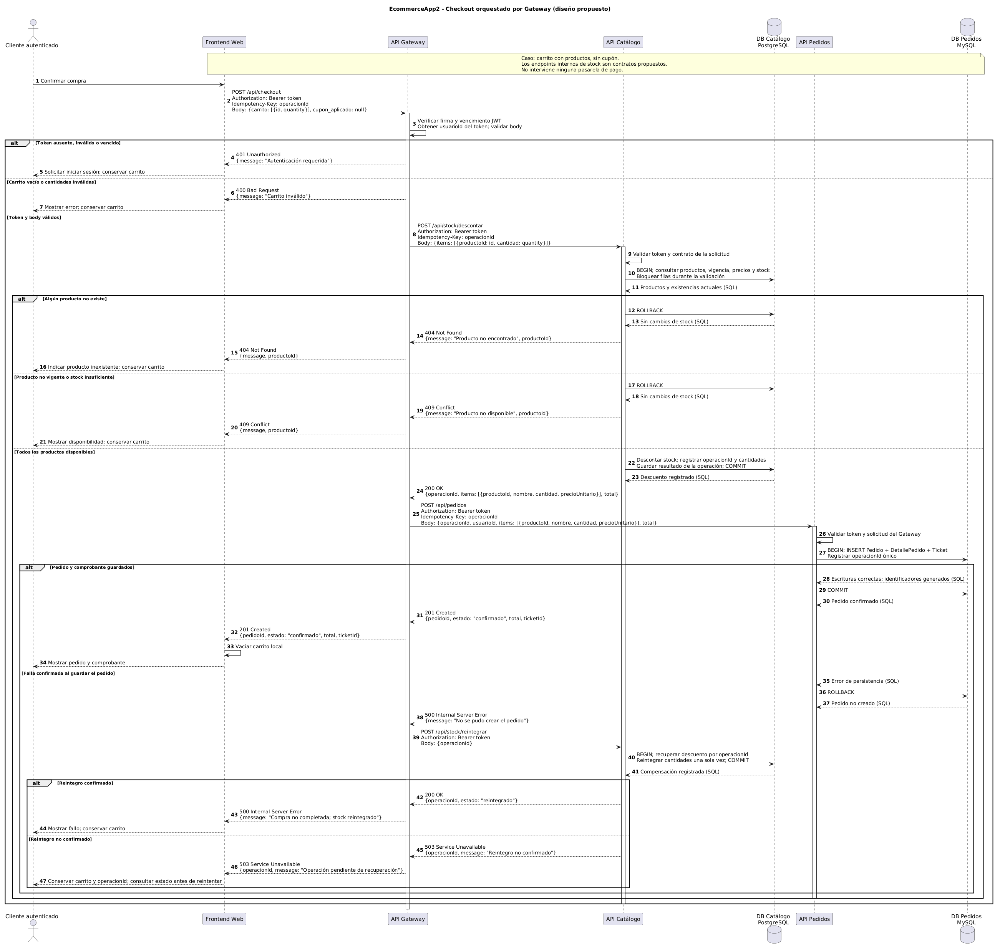
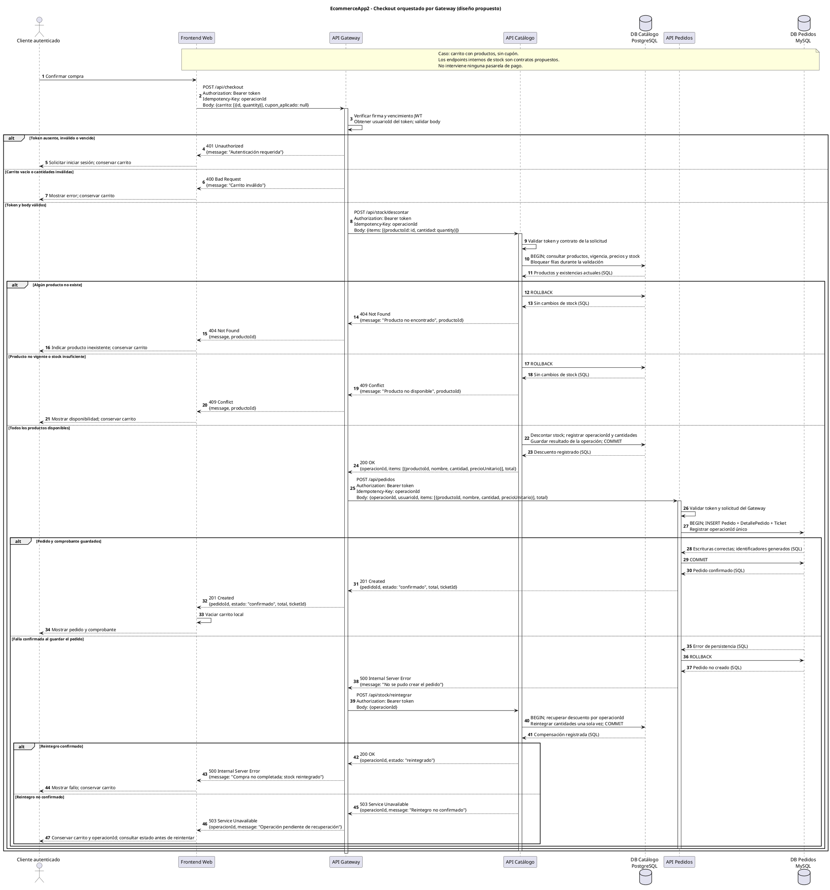

# Tienda Online — EcommerceApp2

### **PP3 — Desarrollo y Aplicación de Sistemas en la Nube · IFTS Nº16**

Docente: Damián Wajser

#

#### **Integrantes**

- Lucía Corral
- Pablo Demartini
- Carla Guisande
- Ignacio Hernandez
- Ignacio Vidal

#

#

## 1. De qué se trata el proyecto

**Tienda Online** es una aplicación web de comercio electrónico dirigida a pequeños comercios que venden productos de tecnología y artículos para el hogar. Permite que sus clientes consulten el catálogo, busquen por nombre, filtren por categoría, agreguen productos al carrito y confirmen una compra. Los usuarios pueden registrarse e iniciar sesión, mientras que el personal autorizado dispone de una dashboard administrativo para gestionar el stock de productos y alta y baja de productos y de usuarios.

El problema que busca resolver es la dispersión de la información de venta: cuando un comercio recibe consultas por mensajes y mantiene precios y existencias en listas separadas, el cliente necesita consultar qué está disponible y el personal debe revisar los datos para cada operación. La aplicación reúne el catálogo, los precios y el stock en una misma plataforma; durante el checkout, el servidor verifica la disponibilidad y calcula el total a partir de los precios guardados en la base de datos.

El público objetivo comprende dos tipos de usuarios: **clientes** que quieren consultar productos y preparar sus compras desde un navegador, y **administradores** que necesitan mantener la información del comercio.

Para los _clientes_, el beneficio es contar con un catálogo consultable y una confirmación inmediata del checkout.
Para los _administradores_, es gestionar los datos desde una interfaz común.

### Vista general del sistema

## 2. Diagrama de arquitectura

**Vista general en formato de secuencia:** Reúne los participantes del sistema y muestra tres escenarios independientes:

- **login**
- **consulta de producto**
- **checkout**.
  Incluye _métodos_, _rutas_, _cuerpos_, _respuestas HTTP_ y a*lternativas*.
  El Gateway no tiene base e datos y cada API consulta exclusivamente su propia base.
  #

```plantuml
@startuml
title EcommerceApp2 - Vista general de comunicaciones
autonumber
actor Usuario as u
participant "Frontend Web" as f
participant "API Gateway\nSin base de datos" as g
participant "API Usuarios" as au
participant "API Catálogo" as ac
participant "API Pedidos" as ap
database "DB Usuarios\nSQLite" as du
database "DB Catálogo\nPostgreSQL" as dc
database "DB Pedidos\nMySQL" as dp

note over f,dp
Diseño propuesto: tres escenarios independientes.
Frontend -> Gateway -> APIs; cada API usa solo su base.
Las solicitudes HTTP usan JSON; las consultas SQL no tienen status HTTP.
end note

group 1. Inicio de sesión
    u -> f: Iniciar sesión
    f -> g: POST /api/auth/login\nBody: {email, password}
    activate g
    alt Faltan campos obligatorios
        g --> f: HTTP 400 Bad Request\n{message: "Email y password son obligatorios"}
        f --> u: Mostrar error de validación
    else Campos completos
        g -> au: POST /api/auth/login\nBody: {email, password}
        activate au
        au -> du: SELECT usuario por email
        du --> au: Usuario y hash de contraseña, o sin resultados
        au -> au: Comparar contraseña con bcrypt
        alt Credenciales válidas
            au -> au: Generar JWT
            au --> g: HTTP 200 OK\n{token, user}
            g --> f: HTTP 200 OK\n{token, user}
            f --> u: Mostrar sesión iniciada
        else Credenciales inválidas
            au --> g: HTTP 401 Unauthorized\n{message: "Credenciales inválidas"}
            g --> f: HTTP 401 Unauthorized\n{message: "Credenciales inválidas"}
            f --> u: Mostrar error de autenticación
        end
        deactivate au
    end
    deactivate g
end

group 2. Consultar un producto
    u -> f: Seleccionar producto
    f -> g: GET /api/productos/{id}
    activate g
    g -> ac: GET /api/productos/{id}
    activate ac
    ac -> dc: SELECT producto por id
    dc --> ac: Producto o sin resultados
    alt Producto encontrado
        ac --> g: HTTP 200 OK\n{id, nombre, precio, stock, categoria}
        g --> f: HTTP 200 OK\n{id, nombre, precio, stock, categoria}
        f --> u: Mostrar detalle del producto
    else Producto inexistente
        ac --> g: HTTP 404 Not Found\n{message: "Producto no encontrado"}
        g --> f: HTTP 404 Not Found\n{message: "Producto no encontrado"}
        f --> u: Mostrar producto no encontrado
    end
    deactivate ac
    deactivate g
end

group 3. Confirmar una compra sin cupón
    u -> f: Confirmar compra
    f -> g: POST /api/checkout\nAuthorization: Bearer {jwt}\nIdempotency-Key: operacionId\nBody: {carrito: [{id, quantity}], cupon_aplicado: null}
    activate g
    g -> g: Validar JWT y carrito
    alt Token ausente, inválido o vencido
        g --> f: HTTP 401 Unauthorized\n{message: "Autenticación requerida"}
        f --> u: Solicitar inicio de sesión
    else Carrito vacío o cantidades inválidas
        g --> f: HTTP 400 Bad Request\n{message: "Carrito inválido"}
        f --> u: Mostrar error de validación
    else Token y carrito válidos
        g -> ac: POST /api/stock/descontar\nAuthorization: Bearer {jwt}\nIdempotency-Key: operacionId\nBody: {items: [{productoId, cantidad}]}
        activate ac
        ac -> dc: BEGIN; consultar y bloquear productos\nValidar vigencia y stock
        dc --> ac: Productos, precios y existencias
        alt Producto inexistente o no disponible
            ac -> dc: ROLLBACK
            dc --> ac: Sin cambios
            alt Producto inexistente
                ac --> g: HTTP 404 Not Found\n{message: "Producto no encontrado"}
                g --> f: HTTP 404 Not Found\n{message: "Producto no encontrado"}
            else Producto no vigente o stock insuficiente
                ac --> g: HTTP 409 Conflict\n{message: "Producto no disponible"}
                g --> f: HTTP 409 Conflict\n{message: "Producto no disponible"}
            end
            f --> u: Mostrar error; conservar carrito
        else Productos disponibles
            ac -> dc: Descontar stock y registrar operacionId; COMMIT
            dc --> ac: Descuento registrado
            ac --> g: HTTP 200 OK\n{operacionId, items, total}
            note over g,ap
            items = [{productoId, nombre, cantidad, precioUnitario}]
            Precios obtenidos de Catálogo; usuarioId obtenido del JWT.
            end note
            g -> ap: POST /api/pedidos\nAuthorization: Bearer {jwt}\nIdempotency-Key: operacionId\nBody: {operacionId, usuarioId, items, total}
            activate ap
            ap -> dp: BEGIN; INSERT Pedido, DetallePedido y Ticket
            alt Pedido guardado
                dp --> ap: Identificadores generados
                ap -> dp: COMMIT
                dp --> ap: Pedido confirmado
                ap --> g: HTTP 201 Created\n{pedidoId, ticketId, estado: "confirmado", total}
                g --> f: HTTP 201 Created\n{pedidoId, ticketId, estado: "confirmado", total}
                f --> u: Mostrar confirmación y vaciar carrito local
            else Falla confirmada al guardar el pedido
                dp --> ap: Error de persistencia
                ap -> dp: ROLLBACK
                dp --> ap: Pedido no creado
                ap --> g: HTTP 500 Internal Server Error\n{message: "No se pudo crear el pedido"}
                g -> ac: POST /api/stock/reintegrar\nAuthorization: Bearer {jwt}\nBody: {operacionId}
                ac -> dc: Reintegrar stock una sola vez por operacionId
                dc --> ac: Resultado de la compensación
                alt Reintegro confirmado
                    ac --> g: HTTP 200 OK\n{operacionId, estado: "reintegrado"}
                    g --> f: HTTP 500 Internal Server Error\n{message: "Compra no completada; stock reintegrado"}
                else Reintegro no confirmado
                    ac --> g: HTTP 503 Service Unavailable\n{operacionId, message: "Reintegro no confirmado"}
                    g --> f: HTTP 503 Service Unavailable\n{operacionId, message: "Operación pendiente de recuperación"}
                end
                f --> u: Mostrar error; conservar carrito y operacionId
            end
            deactivate ap
        end
        deactivate ac
    end
    deactivate g
end
@enduml
```

### Responsabilidades

| Componente   | Responsabilidad                                                                                        | Base de datos                                                           |
| ------------ | ------------------------------------------------------------------------------------------------------ | ----------------------------------------------------------------------- |
| Frontend Web | Interfaz común para clientes y administradores; envía solicitudes al Gateway.                          | Ninguna base del servidor; puede utilizar almacenamiento del navegador. |
| API Gateway  | Punto de entrada, validación JWT, enrutamiento, composición de respuestas y coordinación del checkout. | **Ninguna.**                                                            |
| API Usuarios | Registro, login, usuarios, clientes y persistencia de carritos.                                        | SQLite exclusiva de Usuarios.                                           |
| API Catálogo | Productos, categorías, stock, precios y cupones.                                                       | PostgreSQL exclusiva de Catálogo.                                       |
| API Pedidos  | Pedidos, detalles, tickets y reglas del dominio de checkout/pedidos.                                   | MySQL exclusiva de Pedidos.                                             |

El módulo Checkout de API Pedidos conserva las reglas para crear y registrar pedidos. La **orquestación entre APIs** se concentra en el Gateway: este obtiene la información autorizada del Catálogo y solicita la creación del pedido a API Pedidos.

### Reglas de comunicación

- El frontend consume únicamente la API del Gateway.
- El Gateway llama a las tres APIs mediante HTTP(S), con contratos REST y cuerpos JSON. No realiza consultas SQL.
- Cada API accede solo a su propia base. Ningún servicio lee directamente las tablas de otro.
- Para este diseño, la comunicación de negocio entre dominios se coordina desde el Gateway; no se proponen llamadas directas Usuarios → Catálogo, Catálogo → Pedidos ni Pedidos → Usuarios.
- API Usuarios emite los JWT. Gateway verifica firma y vencimiento; los servicios también validan las peticiones sensibles que reciben.
- CORS se configura para el origen del frontend en el Gateway. CORS no reemplaza autenticación ni restricciones de acceso a los servicios.
- SQLite es un archivo local del servicio Usuarios, no un servidor de base de datos separado. Se representa como una base propia por su responsabilidad y aislamiento.
- Por el formato solicitado, esta vista general muestra participantes, líneas de vida y mensajes HTTP. Las dos secuencias específicas desarrollan login y checkout. Las ubicaciones propuestas de despliegue se conservan en la tabla y el apartado de alojamiento.

## 3. Diagrama de secuencia

#### 1 — Inicio de sesión

**Objetivo:** autenticar a un cliente o administrador y devolver un JWT a través del Gateway.

**Participantes:** usuario, Frontend Web, API Gateway, API Usuarios y DB Usuarios (SQLite). El Gateway no consulta la base: reenvía la solicitud a Usuarios.

**Contrato propuesto:**

- `POST /api/auth/login` existe como ruta en el backend base y se conserva en la separación.
- El body contiene `email` y `password`; las contraseñas almacenadas se comparan mediante bcrypt.
- API Usuarios emite el token. No se agrega una base al Gateway para autenticar.
- Respuestas: `200` para login correcto, `400` para campos obligatorios ausentes, `401` para credenciales inválidas y `500` para error interno.
- La carga posterior de archivos de la pantalla destino queda fuera del caso de autenticación.
- Una caída de conexión al servicio se traduce a `503 Service Unavailable` en el Gateway, sin establecer una sesión.

#### 2 — Confirmar compra mediante el Gateway

**Objetivo:** comprobar productos y stock en API Catálogo y crear Pedido, DetallePedido y Ticket en API Pedidos. El Gateway coordina ambos servicios.

**Caso seleccionado:** cliente autenticado, carrito enviado por el frontend y compra sin cupón. La existencia del módulo Cupón en Catálogo no obliga a aplicar uno en todas las compras.

### Contratos internos propuestos

| Origen → destino   | Solicitud                    | Datos                                                                                                                         | Respuesta                                                                         |
| ------------------ | ---------------------------- | ----------------------------------------------------------------------------------------------------------------------------- | --------------------------------------------------------------------------------- |
| Frontend → Gateway | `POST /api/checkout`         | Bearer token, Idempotency-Key; `carrito: [{id, quantity}]`, `cupon_aplicado: null`                                            | `201` con pedido y comprobante, o error del flujo.                                |
| Gateway → Catálogo | `POST /api/stock/descontar`  | Bearer token, Idempotency-Key; `items: [{productoId, cantidad}]`                                                              | `200` con precios e items; `404` si falta producto; `409` si no está disponible.  |
| Gateway → Pedidos  | `POST /api/pedidos`          | Bearer token, Idempotency-Key; `operacionId`, `usuarioId`, `items: [{productoId, nombre, cantidad, precioUnitario}]`, `total` | `201` con `pedidoId`, estado, total y `ticketId`; `500` si falla la persistencia. |
| Gateway → Catálogo | `POST /api/stock/reintegrar` | Bearer token; `operacionId`                                                                                                   | `200` si se compensa; `503` si no se confirma la recuperación.                    |

Estas rutas de stock y sus contratos son **decisiones propuestas de diseño**, pendientes de implementación y acuerdo del equipo. Aunque la ruta `POST /api/pedidos` ya existe en el backend base, su contrato separado, transacción y vínculo con el checkout requieren adaptación.

### Consistencia entre servicios

Cada API utiliza una transacción local sobre su base. No existe un único `COMMIT` que abarque simultáneamente PostgreSQL y MySQL. Si Catálogo descuenta stock y Pedidos confirma que no pudo crear el pedido, Gateway solicita una operación compensatoria para devolver las unidades.

`operacionId` identifica el mismo intento de compra en ambas APIs. Catálogo guarda el descuento y el reintegro; Pedidos guarda una referencia única al intento. Los reintentos con la misma clave deben reutilizar el resultado y comprobar que el contenido sea el mismo, sin duplicar pedidos ni descontar stock dos veces. Esa información durable pertenece a las APIs, **no a una base del Gateway**.

Si se corta la conexión y no se sabe si Pedidos llegó a confirmar, **no se debe reintegrar stock inmediatamente ni crear otro pedido con una clave distinta**. Primero se consulta el resultado por `operacionId` mediante un contrato de recuperación a implementar. Un mecanismo durable de conciliación en los servicios también es necesario para recuperar operaciones si el Gateway se reinicia. El diagrama muestra el caso de falla confirmada y compensación; no declara resueltos los fallos de red de resultado incierto.

El caso vacía el carrito local del navegador. La limpieza del carrito persistido en API Usuarios es una operación adicional que deberá coordinarse si el equipo incorpora su recuperación al flujo de compra; no se afirma aquí que ambos carritos se sincronicen automáticamente.

### Códigos de estado y autenticación

La propuesta usa `401` para token ausente, inválido o vencido, `403` para falta de permisos y `201` cuando se crea el pedido. Es una decisión del contrato objetivo. El backend base revisado tenía `403` para token inválido/vencido y `200` en checkout, por lo que no debe presentarse como código ya adaptado.

Las respuestas de SQL y las acciones del usuario no son respuestas HTTP: describen sus resultados sin inventar status codes.

## Correspondencia entre las tres piezas

- Login utiliza Frontend, Gateway, Usuarios y SQLite, todos presentes en la arquitectura.
- Checkout utiliza Frontend, Gateway, Catálogo/PostgreSQL y Pedidos/MySQL, todos presentes en la arquitectura.
- En ambos casos el frontend se comunica solo con Gateway.
- Gateway no tiene base ni acceso SQL.
- No se introducen una pasarela de pago, un servicio de correo ni un cuarto servicio de dominio.
- El diseño comprende **cuatro procesos backend** si se cuenta al Gateway: Gateway + Usuarios + Catálogo + Pedidos. Son **tres APIs de dominio y tres bases**.
